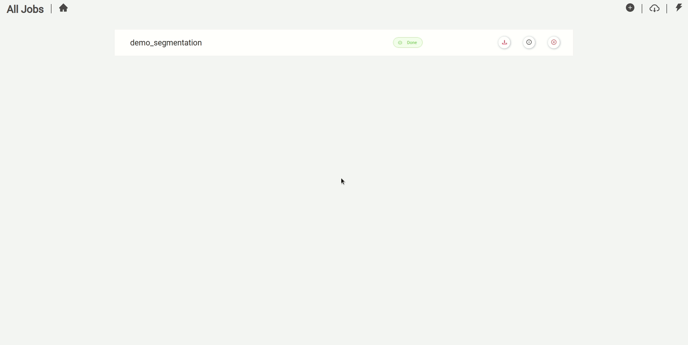

#  GluonCv Semantic Segmentation Training GUI  for Linux

This repository allows you to get started with training a State-of-the-art Deep Learning model with little to no configuration needed! You provide your labeled dataset and you can start the training right away. This repository is based on [Gluoncv's](https://cv.gluon.ai/build/examples_segmentation/index.html) Framework. You can check the networks statistics [here](https://gluon-cv.mxnet.io/model_zoo/segmentation.html)

- All supported networks used in this project are taken from [GluonCv model zoo](https://gluon-cv.mxnet.io/model_zoo/segmentation.html) 
- The app was tested with **Google Chrome**, hence it is recommended to use Chrome when training.
- This repository supports training on both **CPU** and on multiple **GPUs**
- **Intel MKL** is supported on both **CPU** and **GPU** for faster training 


<br>
<br>

## Prerequisites

- Ubuntu 18.04 LTS or 20.04 LTS 
- NVIDIA Drivers (418.x or higher) (optional : for gpu training )
- Docker CE latest stable release 
- NVIDIA Docker 2 (optional: for gpu training)
- Docker-Compose

<br>

## How to check for prerequisites

**To check if you have docker-ce installed:** 

​               `docker --version`

**To check if you have docker-compose installed:**

​                `docker-compose --version`

**To check if you have Nvidia-docker installed:**

​     			     `dpkg -l | grep nvidia-docker`


**To check your Nvidia drivers version, open your terminal and type the command `nvidia-smi`**


<br>

## Installing Prerequisites

**This step is very important and if not performed the solution will not work properly)**** 

- If you don't have neither docker nor docker-compose use the following  command 

  ​			`chmod +x install_full.sh && source install_full.sh`

- If you have docker ce installed and wish only to install docker-compose and perform necessary operations,  use the following command 

  ​			`chmod +x install_compose.sh && source install_compose.sh`

- Install NVIDIA Drivers (418.x or higher) and NVIDIA Docker for GPU training by following the [official docs](https://github.com/nvidia/nvidia-docker/wiki/Installation-(version-2.0))


## Setting Up Project Requirements

**This step is necessary to be able to run the solution correctly.**

The setup script will adjust the base directory and the training docker image name needed to start a training container with the proper architecture (CPU/GPU)

- Run the following command

   `chmod +x setup_solution_parameters.sh && source setup_solution_parameters.sh`

  After which you will be prompted to choose **build architecture GPU/CPU** for the training solution. 

  
<br>
<br>

- #### Validating the prerequisites installation

  - Make sure that the `base_dir` field in  `docker_sdk_api/assets/paths.json` is correct (it must match the path of the root of the repo on your machine).	

    

  - Make sure that the `image_name` field in  `docker_sdk_api/assets/paths.json` is correct (it must match your chosen architecture for the training 
    `gluoncv_semantic_segmentation_training_api_cpu` or `gluoncv_semantic_segmentation_training_api_gpu`).	

    


  - Go to  `gui/src/environments/environment.ts ` and `gui/src/environments/environment.prod.ts  ` and change the following:

    - All fields `dockerSDKUrl` and `trainingUrl` and `inferenceAPIUrl`:  must match the IP address of your machine (**Use the `ifconfig `command to check your IP address . Please use your private IP which starts by either 10. or 172.16.  or 192.168.**)
    
      
      
      `gui/src/environments/environment_prod.ts`
      
      
      
      `gui/src/environments/environment.ts`

  - If you are behind a proxy:
      - Enter you proxy settings in the `<base-dir>/proxy.json ` file

        

      - Enter the following command:

        ```sh
        python3 set_proxy_args.py
        ```


### Remark - docker sdk port

**Docker SDK API** uses the port **4222** to run.
In case this port is used by another application. The api can be configured to run on a different port by doing the following steps:

- Go to **docker_sdk_api/docker/Dockerfile** and change the value after the --port flag in the CMD command.

  

- Go to **gui/src/environments/environment.ts** and **gui/src/environments/environment.prod.ts** and change the `dockerSDKUrl` field value to match the newly selected port:

  

  *gui/src/environments/environment.ts*


  

  *gui/src/environments/environment.prod.ts*

After those modification you should rebuild the solution for changes to take place.

## Label your own dataset

To label your own dataset for semantic segmentation training, you can install the [labelme](https://github.com/wkentaro/labelme) labeling tool.

**Make sure to convert the labels to the corresponding format required for the semantic segmentation workflow (Read the [semantic segmentation](https://github.com/wkentaro/labelme/tree/master/examples/semantic_segmentation) labelme documentation)**

**JPEGImages** and **SegmentationClassPNG** are the respective images and labels folders needed , place it in your projects repository.


## Dataset Folder Structure

We offer a sample dataset to use for training. It's called "dummy_dataset". It has 3 classes : "background","pad","circle".

The following is an example of how a dataset should be structured. Please put all your datasets in the data folder.

```sh
├──datasets/
    ├──dummy_dataset/
        ├── images
        │   ├── img_1.jpg
        │   └── img_2.jpg
        ├── labels
        │   │── img_1.png
        │   │── img_2.png
        │── objectclasses.json


```

#### objectclasses.json file example

  You must include in your dataset an objectclasses.json file with a similar structure to the example below:

  


## Light-weight Mid-weight and Heavy-weight Solution

**Lightweight (default mode):** Building the docker image without pre-downloading any online pre-trained weights, the online weights will be downloaded when needed after running the image.


**Midweight:** Downloading specific supported  online pre-trained weights during the docker image build.<br>
 To do that, open the json file `training_api/assets/networks.json` and change the values of the networks you wish to download to **true**. 


**Heavyweight:** Downloading all the supported  online pre-trained weights during the docker image build. <br>
 To do that, open the json file `training_api/assets/networks.json` and change the value of **"select_all"** to **true**.


## Build the Solution

We offer **Intel MKL** support for both **CPU** and **GPU** version but please **keep in mind** the following: 

- If you wish to deploy the **CPU with MKL** support solution you may notice **longer build time and larger docker image size** but with **faster training time**
- If you wish to deploy the **GPU with MKL** support solution you will **only benefit from MKL** accelerated training time  **when choosing CPU architecture in the general setting page in the training GUI** and you will also notice **longer build time and larger docker image** but with **faster training time**
- If you're note planning on taking advantage of the **Intel MKL**  support please use the standard **GPU** and **CPU** build and run. 

**You can also refer to [training support matrix](##Training Support Matrix) for more information.**


- ##### GPU build

  If you wish want to deploy the training work-flow in **GPU** mode, please write the following command from the repository's root directory 

  ```sh
  docker-compose -f build/build_gpu.yml build
  ```

- ##### GPU with MKL support build

  If you wish want to deploy the training work-flow in **GPU with MKL support** mode, please write the following command from the repository's root directory 

  ```sh
  docker-compose -f build/build_gpu_mkl.yml build
  ```

- ##### CPU build

  If you wish want to deploy the training work-flow in **CPU** mode, please write the following command from the repository's root directory 

  ```sh
  docker-compose -f build/build_cpu.yml build
  ```

- ##### CPU with MKL support build

  If you wish want to deploy the training work-flow in **CPU with MKL support** mode, please write the following command from the repository's root directory 

  ```sh
  docker-compose -f build/build_cpu_mkl.yml build
  ```
<br>
<br>

## Run the Solution

- ##### GPU run

  If you wish want to deploy the training work-flow in **GPU** mode, please write the following command from the repository's root directory 

  ```sh
  docker-compose -f run/run_gpu.yml up
  ```

- ##### GPU with MKL support run

  If you wish want to deploy the training work-flow in **GPU with MKL support** mode, please write the following command from the repository's root directory 

  ```sh
  docker-compose -f run/run_gpu_mkl.yml up
  ```

- ##### CPU run

  If you wish want to deploy the training work-flow in **CPU** mode, please write the following command from the repository's root directory 

  ```sh
  docker-compose -f run/run_cpu.yml up
  ```

- ##### CPU with MKL support run

  If you wish want to deploy the training work-flow in **CPU with MKL support** mode, please write the following command from the repository's root directory 

  ```sh
  docker-compose -f run/run_cpu_mkl.yml up
  ```


## Usage

- If the app is deployed on your machine:  open your web browser and type the following: `localhost:4200` or `127.0.0.1:4200  `


- If the app is deployed on a different machine: open your web browser and type the following: `<machine_ip>:4200`

<br>

#### 1- Preparing Dataset

Prepare your dataset for training


<br>


#### 2- Specifying General Settings

Specify the general parameters for you docker container


<br>

#### 3- Specifying Basic Hyper-parameters 

Specify the basic hyper-parameters for the training job


<br>

#### 4- Specifying Advanced Hyper-parameters 

Specify the advanced hyper-parameters for the training job


<br>

#### 5- Checking training logs

Check your training logs to get better insights on the progress of the training. You can also download logs.


<br>

#### 6- Downloading Models

Download your model to use it in your applications or with the inference API


<br>

#### 7- Stopping and Delete the model's container

Delete the container's job to stop an ongoing job or to remove the container of a finished job. (Finished jobs are always available to download)


#### 8- Testing the Model with Inference API 

You can test your trained model using the inference API provided 



<br>
<br>

## Training Hyper Parameters

- **Learning rate:** learning rate defines the speed of with network updates its parameters. Using low learning rate will result in smooth convergance but will slow the learning process and vice-versa. (default value : 0.001)
- **Batch size:** batch size used for training. It is the number of n_samples passed to the network before parameter update occures.(default value : 1)
- **Epochs:** number of epochs is the number of times where the training data is passed to the network. The best practice is to increase the number of epochs until validation accuracy start decreasing even if the training accuracy start increasing, this is helpful to eliminate overfitting  (default value : 15)
- **Validation batch size:** batch size used for validating. Similar to the training epochs but used for the validation process (default value : 1)
- **Momentum:** momentum is used to specify the direction of the next iteration using the previous iteration. It is helpful because is eleminate oscillations in training. (default value : 0.9 recommended value between 0.5 and 0.9)
- **Weight decay**: weight-decay. This is a small number added to the loss function to prevent the loss from encreasing exponentially(default value : 0.0001)
- **Number of workers**: number of workers that fetch data and load them into memory (default value : 1)
- **Crop size:** choosing the input size of the network (use whether data_augmenting[data augmenting explained below] is true or false) (default value : 480)
- **Base size:** size used when augmenting (images are resized between base_size/2 and base_size*2 and then cropped to match input_size which created a zoom-out zoom-in effect) (default value : 520)
- **Augment Data:** set to true to perform our data augmentation before training , false to just resize to input_size and train. If true,check the augmentation documentation [here](./docs/Data_Augmentation.md) file to see how the data is augmented (default value : true) 

<br>
<br>

## Training Support Matrix


|         Solution         |                     Build                      |       Training       |                            Notes                             |
| :----------------------: | :--------------------------------------------: | :------------------: | :----------------------------------------------------------: |
|         **GPU**          |    Normal build time and docker image size     | normal training time | Better alternative if you are not planning on training using your CPU |
| **GPU with MKL support** | Longer build time and larger docker image size | faster training time |         when choosing CPU architecture  in GUI only          |
|         **CPU**          |    Normal build time and docker image size     | normal training time |  Better alternative if you want faster and lighter solution  |
| **CPU with MKL support** | Longer build time and larger docker image size | faster training time |     Better alternative if you wish faster training time      |

<br>

<br>

## Known Errors 

  You might face some errors in some cases during the training. Most common ones are:

  - `The running container has no RepoTag please kill to proceed: Container ID: <id-container>` This issue is caused by some container not having a name, in that case you should rename that container or kill (make sure it is safe to remove this container) it via `docker kill <id-container>`.
  - `Job Not Started: 404 Client Error Not Found("pull access denied for <image-name>, repository does not exists or may require 'docker login' ...)` this issue is cause when you are trying to run a training docker image that you don't have. The main reason of this is not properly building the training_api or not setting up project requirements please refer to **Setting Up Project Requirements** section in the documentation.
  - `Dataset Not Valid` this error means that you dataset structure is not valid or the images/labels formate are not supported.
  - Training job not started after general settings step: One of the main reason is that the paths are not adjusted in `docker_sdk_api/assets/paths.json` field `base_dir`. You can solve this issue by running `./setup_solution_parameters.sh` and choosing the training version you want to use `GPU/CPU`.

<br>
<br>

## Acknowledgments

- Roy Anwar, BMW Innovation Lab, Munich, Germany
- Hadi Koubeissy, [inmind.ai](https://inmind.ai/), Beirut, Lebanon
- Afrah Hassan,  [inmind.ai](https://inmind.ai/), Beirut, Lebanon
- Ismail Shehab, [inmind.ai](https://inmind.ai/), Beirut, Lebanon
- Joe Sleimen, [inmind.ai](https://inmind.ai/), Beirut, Lebanon
- Jimmy Tekli, BMW Innovation Lab, Munich, Germany
